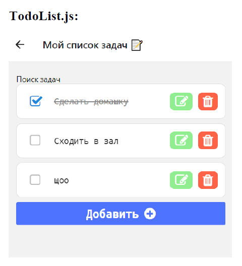

# React Native приложение To-do List 📝

Мобильное приложение на React Native с помощью Expo Go.


Реализован функционал добавления, удаления и редактирования списка.
Можно отмечать выполненные дела и отменять их.
Добавлена интеграция с ActionSheetIOS.

Для запуска на своем локальном компьютере следуйте следующим шагам:

## Начало 🔰

Убедитесь, что следующее установлено на вашем компьютере:

- [Git](https://git-scm.com/)
- [Node.js](https://nodejs.org/en)
- [npm](https://www.npmjs.com/) (Node Package Manager)

## Клонирование репозитория 📁

```bash
git clone https://github.com/shewafem/react-native-app.git
```

## Установка зависимостей 📦

Установите зависимости, используя npm:

```bash
npm install
```

## Запуск проекта 🚀

```bash
npm start
```

## Expo Go 📱

Скачайте [Expo Go](https://expo.dev/go) приложение на ваше мобильное устройство, просканируйте QR-код с помощью камеры из терминала и все готово! 🤩